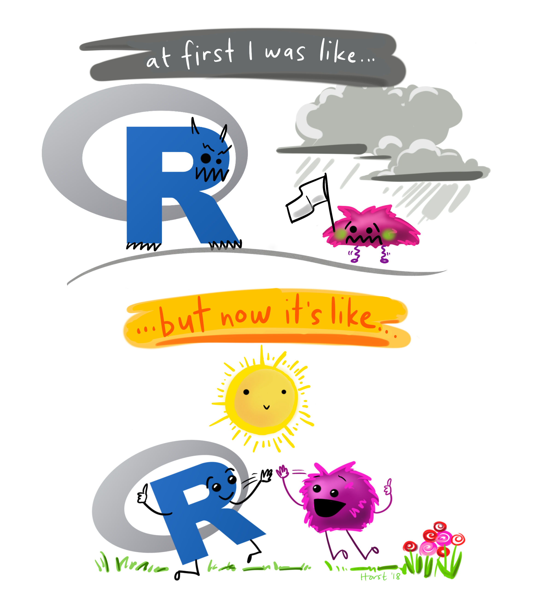

```{r setup, include=FALSE}
knitr::opts_chunk$set(collapse = TRUE)
```

It has become increasingly clear that many college students have found themselves without summer plans.  Unfortunately, this blog entry is not a list of possible employment opportunities.  Instead, it is a compilation of statistics and data science projects to enhance a summer spent socially distant.

The list below represents opportunities at a variety of levels.  If you are just beginning or quite advanced, there are many ideas for you.

* **a note on data science**:  as a college professor, I am often queried by my students for advice on what they should do if they want to pursue data science after their undergraduate degree.   My best advice is to:  **do data science**.  That is, worry less about which classes to take or which graduate schools to apply to.  Instead, worry more about learning data science skills, becoming proficient in data wrangling, and thinking critically about problem solving.  Take some statistics, math, and CS classes (it doesn't matter hugely which classes).  If you have a solid background in statistics, math, and CS + some decent data science chops you will be able to accomplish whatever you want.
 

* **a note on software**: The majority of the resources / links below are for doing data science in R. There are many good software options, however the resources for getting started in R are outstanding, and you are highly encouraged to check them out.
 
 
### 1. `GitHub`


<figure>

</figure>

While not necessarily the first task that you should undertake this summer, the first recommendation is to set up a GitHub account and use it to post anything you do.  Each project should be a separate repository, and you should make sure to always have a README file so that others (and you six months from now) can easily see what you've done.

If you are at all serious about doing data science at any point down the road, now is the time to start collecting your data projects into a single place so that your work can be highlighted.
 
* The ultimate site for getting GitHub up and running (and talking with RStudio) is: https://happygitwithr.com/
 
* If you'd like to set up your own website, try using https://rstudio.github.io/distill/website.html
 
Are you more advanced?
 
* make your own website using bookdown, https://bookdown.org/yihui/bookdown/
 
* or a blog using blogdown, https://bookdown.org/yihui/blogdown/
 
 
### 2. Starting with R 

<figure>

</figure>
 
Particularly if you are new to R, an amazing book to work through is called "R for Data Science" by Grolemund & Wickham (https://r4ds.had.co.nz/).  There are many problems you can try out, and the text provides a wealth of ideas for working through data analysis problems.  Even if you have been using R for many years, my guess is that the text contains many opportunities to learn how to work with new data structures.
 
* interactive tutorials for working through "R for Data Science" at https://rstudio.cloud/learn/primers
 
* for a good start to R in general, check out  https://education.rstudio.com/learn/
 
* There is a more advanced version to the Grolemund & Wickham text that you might want to try out if you are an advanced R user ("Advanced R" by Wickham, https://adv-r.hadley.nz/).   The advanced version includes quite a bit on programming and why R works the way it does.
 
 
### 3. Modeling Data 

<figure>

</figure>

Interested in modeling?
 
* for modeling in R, visit the new tidymodels Get Started page: https://www.tidymodels.org/start/
 
* arguably the best text on statistical learning models (and freely available!) is "An Introduction to Statistical Learning with Applications in R" by James et al. http://faculty.marshall.usc.edu/gareth-james/ISL/
 
 
### 4. Natural Language Processing

<figure>

</figure>

Interested in text analysis / natural language processing?
  
* Tidytext tutorials:
https://computational.journalism.wisc.edu/2018/11/16/tidytext-tutorials/
 
* Chapter 11: tidy text:
https://datascienceineducation.com/c11.html

* `stringr` cheat sheet: https://github.com/rstudio/cheatsheets/raw/master/strings.pdf
 
* Text datasets to get started with:
https://github.com/EmilHvitfeldt/R-text-data
 
* Blog post(s) by Julia Silge:
https://juliasilge.com/blog/evaluating-stm/
 
* Julia Silge & David Robinson's book:
https://www.tidytextmining.com/
 
* Implementation of Google's BERT framework into R:
https://github.com/jonathanbratt/RBERT
 
 
### 5. Practice **doing** data science

<figure>

</figure>

One of the most fun things you can do is to practice doing data science.  Below are ideas you could work on for one afternoon or that you could commit a few weeks to figuring out.  You should choose projects that seem fun and to which you might be able to provide a creative approach to solving.
 
* Tidy Tuesday:  every Tuesday a new dataset is posted, and individuals (separately and collaboratively) work to visualize the dataset.  Details at https://github.com/rfordatascience/tidytuesday.
 
* Kaggle.com: is an online community of data scientists who build models, working together to come up with optimal predictions.  You can compete in an ongoing Kaggle competition, or you can work through an old competition where many teams have shared their work and their ideas.
 
* Work through a COVID-19 analysis.  It is worth noting that the current available case data is likely to be under-reported (both cases and deaths across most countries) which makes modeling the actual data somewhat problematic.  Instead, you might try to model COVID-19 related data (e.g., flights in the US, unemployment, emissions, weather patterns, etc.).

<ul style="list-style-type:none">
         <li> Two good resources that have been collecting analyses and other information are: http://www.stat.cmu.edu/~kass/covid.html and https://github.com/mine-cetinkaya-rundel/covid19-r </li>
</ul>  
 
* data for social good:  https://www.drivendata.org/competitions/  provides real data and structures (similar to Kaggle) for working through models and coming up with predictions – all on data which benefits the social good.
 
 
* Other data science competitions: https://towardsdatascience.com/top-competitive-data-science-platforms-other-than-kaggle-2995e9dad93c  
 
### 6. Interactive graphics

<figure>

</figure>

Register for a (free) shiny account, and create a shiny dashboard to highlight the work you are doing!
 
* account: https://shiny.rstudio.com/
 
* gallery: https://shiny.rstudio.com/gallery/
 
* Shiny contest 2020 (deadline passed, but you can practice for next year!):

https://blog.rstudio.com/2020/02/12/shiny-contest-2020-is-here/
 
 
 
### 7. Art and R

<figure>

</figure>

Interested in art?  Make art with data and R!
 
* Getting started with generative art in R: https://djnavarro.net/post/unpredictable-paintings/

* No code, but inspiration: https://www.data-imaginist.com/art

* Follow posts on Twitter: 

https://twitter.com/search?q=%23generative%20%23rstats&src=typed_query

* Illustrations — don't want to code but draw instead? Illustrate your learnings! See https://github.com/allisonhorst/stats-illustrations for inspiration.

* Hand drawn data visualizations? See http://www.dear-data.com/theproject for inspiration.
 
 
### 8. Watch videos and take classes

<figure>

</figure>

Learn some new stuff from videos & webinars!
 
* RStudio has a wealth of amazing videos https://resources.rstudio.com/
 
* Dave on Data's youtube channel: 

https://www.youtube.com/channel/UCRhUp6SYaJ7zme4Bjwt28DQ
 
* Coursera + Johns Hopkins Data Science Specialization: https://www.coursera.org/specializations/jhu-data-science
 
 
 
### 9. Participate in the data science community

<figure>

</figure>


Engage on RStudio Community (https://community.rstudio.com/) or  https://stackoverflow.com/ -- platforms for asking and answering all the questions.  StackOverflow is more comprehensive, but it can be aggressive and unhelpful at times.  RStudio Community is a great place for beginners and way less intimidating than SO.
 
* be sure you know how to make a minimal reproducible example:

https://stackoverflow.com/questions/5963269/how-to-make-a-great-r-reproducible-example
 
* use the `reprex` package in R: https://teachdatascience.com/reprex/
 
 
### 10. Write an R package!


<figure>

</figure>
 
You'll be surprised to learn that creating your own R package can be reasonably straightforward.  Fantastic step-by-step instructions help facilitate putting the R package together. 
 
* how to do it:  https://r-pkgs.org/
 
* really great example to walk through: https://www.erikhoward.net/blog/how-to-create-an-r-data-package/
 
* write a package that contains (only) a cool dataset: https://teachdatascience.com/datapackage/
 

