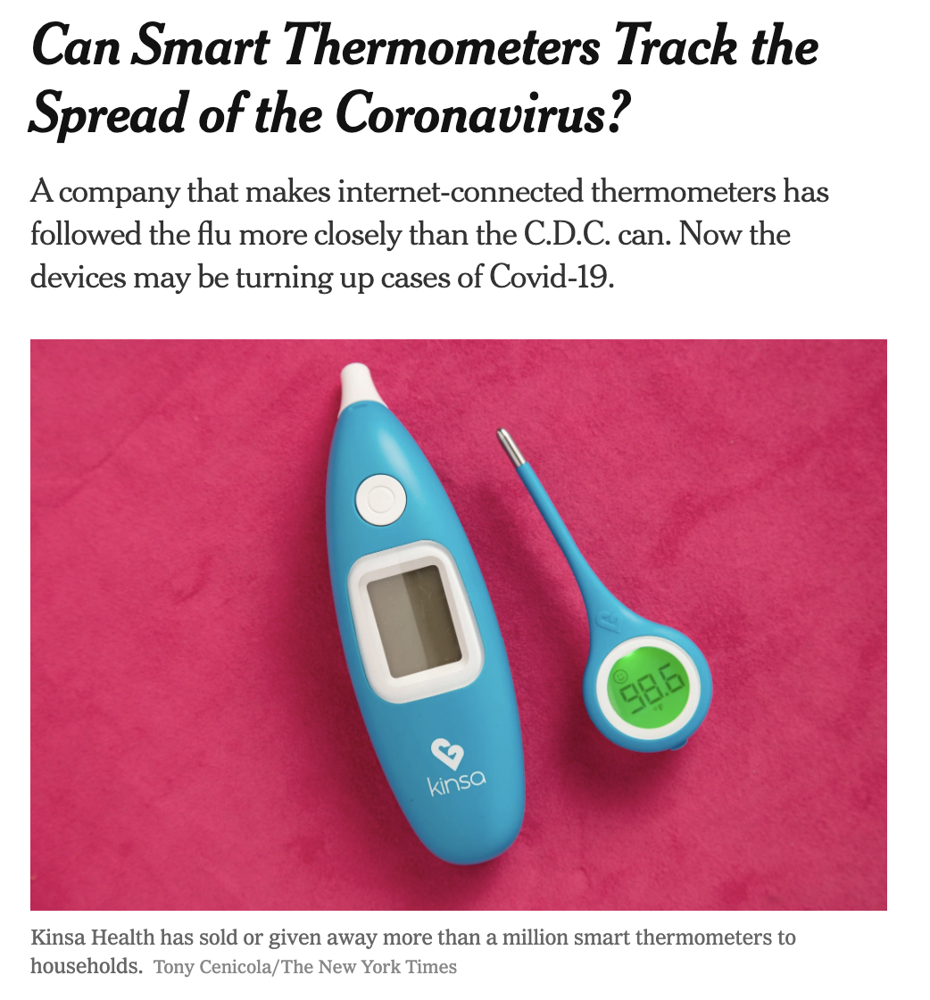

```{r setup, include=FALSE}
knitr::opts_chunk$set(collapse = TRUE)
```


## Data Privacy

Data privacy is an increasingly important problem.
The flood of data available through 
sensors, smartphones, and our interactions on the internet have great potential to improve our lives and 
address long-standing issues and problems.
Yet they also raise critical questions about misuse of such data.

What is data privacy?  And how is it different from anonymous or secure data?

Data privacy is concerned with three main components:  
1. how data are shared  
2. how data are collected or stored  
3. regulatory restrictions   

Data that are **anonymous** keep the identity of the individual hidden, and might or might not be private.  **Secure** data are protected from unwanted uses.  That is, Amazon may be very concerned with keeping their data secure (hidden from competitors), but they may end up selling the data to advertisers (which makes your data not private).

### Conversation around Data Privacy

The National Academies
[Roundtable on Data Science Postsecondary Education](https://nas.edu/dsert) focused on aspects of ethics and privacy during its December 2017 (see https://www.nationalacademies.org/event/12-08-2017/docs/D8EE65EFC7F4B0C368D267EDAD10E5AB1BAFBE3369D2 for the detailed notes from the meeting.)

The meeting featured presentations and discussions by a number of notable individuals:

- "Teaching algorithmic accountability in data science education" Cathy O'Neil (http://mathbabe.org)
- "Uncovering the substance of a data science ethics education" Solon Barocas (https://infosci.cornell.edu/content/barocas)
- "Recognizing and analyzing false claims from big data" Jevin West (https://jevinwest.org)
- "Mathematical approaches to privacy and fairness" Aaron Roth (https://www.cis.upenn.edu/~aaroth)
- "Navigating history, privilege, and power in information and data science" Anna Lauren Hoffmann (https://www.annaeveryday.com)

What are some highlights of this discussion that can be woven into our courses?
Roundtable co-chair [Eric Kolacyk](http://math.bu.edu/people/kolaczyk/) noted that that "there are inherent ethical and privacy implications in the choices data scientists make while framing, obtaining, cleaning, manipulating, and interpreting data".
O'Neil stated that privacy and accountability may not be at the forefront of those using the data that are now available.
Roundtable member [Patrick Perry](https://www.stern.nyu.edu/faculty/bio/patrick-perry) remarked that "privacy, fairness, and accuracy are all trade-offs that are at odds with one another".


### Regulatory Bodies

Unsurprisingly, different structures (e.g., countries, industries) have different regulatory needs.  As personal data becomes a part of all industries, the need to regulate and provide consumer rights grows.

* The European Union's [General Data Protection Regulation (GDPR)](https://gdpr.eu/data-privacy) has among the most restrictive data privacy policies.  They require that companies empower "users to make their own decisions about who can process their data and for what purpose."
* [HIPAA](https://www.hhs.gov/hipaa/index.html) guides the privacy of medical information in the US.
* The [Gramm-Leach-Bliley Act ](https://en.wikipedia.org/wiki/Gramm-Leach-Bliley_Act) put into place a requirement that individuals be informed of the personal financial information being collected about them.
* The [California Consumer Privacy Act](https://oag.ca.gov/privacy/ccpa) provides privacy rights for consumers in California, "including the right to know, the right to delete, and the right to opt-out of the sale of personal information that businesses collect, as well as additional protections for minors."


### Data Privacy in the Classroom

There are myriad approaches and topics to discuss with respect to data privacy.  We start with a definition of data privacy as "focused on the use and governance of personal data" ([IAPP definition](https://iapp.org/about/what-is-privacy/)).  Data privacy is important precisely because information can be misused without the knowledge or consent of the data provider.

One of the biggest data privacy issues is the practice of organizations collecting data without explicit plans for how to use it (yet).  Or, sometimes new (potentially problematic) uses for "old" existing data are found, and it is not possible to obtain retroactive consent. Using examples and case studies allow students to grapple with the trade-offs inherent to data privacy issues.

Recently, smart thermometers have been used to model the spread of COVID-19.  An interesting class discussion could focus on **who** should have access to medical records collected by Kinsa Health (the maker of the thermometer).

{ width=50% }


In our classes, we've engaged with data privacy through these additional examples:

* The downloadable [ethics chapter](http://mdsr-book.github.io/excerpts/mdsr-ethics.pdf) from ["Modern Data Science with R"](http://mdsr-book.github.io) describes how multiple sources of information can be used to probabilistically identify individuals from datasets that were designed to prevent such disclosure.
* We've explored the differences in laws and regulations across regulations in the EU and United States.  The policies relate directly to data privacy and the implications for organizations that interact with users in different countries.
* We've had students read and reflect on ethical frameworks from the [Association of Computing Machinery (ACM)](http://www.acm.org/binaries/content/assets/membership/images2/fac-stu-poster-code.pdf) and the [American Statistical Association (ASA)](https://www.amstat.org/ASA/About/Ethical-Guidelines-for-Statistical-Practice.aspx).


Are there ideas that you've successfully used to teach about data privacy in the classroom?  Are there instructional practices that you've found helpful?  Valuable articles or resources to share?  We would welcome suggestions.


## Learn more

- Roundtable on Data Science Postsecondary Data Education (https://nas.edu/dsert)
- Roundtable #5 on [Ethics and Privacy Concerns](https://www.nationalacademies.org/event/12-08-2017/docs/D8EE65EFC7F4B0C368D267EDAD10E5AB1BAFBE3369D2
- Infusing Ethics into the Development of Engineers:
Exemplary Education Activities and Programs (2016) (https://www.nap.edu/catalog/21889/infusing-ethics-into-the-development-of-engineers-exemplary-education-activities)
- Keller, Shipp, Schroeder, and Kortmaz (2020): Doing Data Science: A Framework and Case Study, *Harvard Data Science Review* (https://hdsr.mitpress.mit.edu/pub/hnptx6lq/release/7)
- Keller, Shipp, and Schroeder (2016): Does Big Data Change the Privacy Landscape? A Review of the Issues, *Annual Review of Statistics and its Application* (https://www.annualreviews.org/doi/10.1146/annurev-statistics-041715-033453)
- chapter on Anonymity and Confidentiality in Martin Monkman's Data Science with R: A resource compendium (https://bookdown.org/martin_monkman/DataScienceResources_book/anonymity-and-confidentiality.html)
- twitter thread on notable women in data privacy: https://twitter.com/WomenInStat/status/1280135184499634181
- International Association of Privacy Professionals: https://iapp.org/about/what-is-privacy/


## About this blog

Last summer we wrote a series of blog entries designed to start conversations around teaching data science, [Teach Data Science](https://teachdatascience.com/).  We covered topics such as data science software, data ingestation, data technologies, data wrangling, visualization & exploration, communication, and key reports and findings on data science.

One key element that was lacking on our 2019 blog was a discussion about and a commitment to teaching the ethical aspects of data science.  We have now found ourselves in the summer of 2020, overwhelmed by the state of the world and re-committed to the ethical challenges which can help data science be a positive force for change.

Although none of us are experts in ethics, we have all included ethics discussions in our classrooms for many years.  In the weeks to come, we will share some of the ways we engage our students in these important topics.  We will provide resources for readings, examples, datasets, and exercises.  We believe that data ethics are part of every data science analysis and classroom experience, and we hope that this summer's blog will entice you into presenting ethical dilemmas and related conversations to your students early and often.


During the summer of 2020, we plan to write a dozen blog entries starting on Monday, July 6th.  We hope that you bookmark the site and check in regularly.  Want a reminder?  Sign up for emails at https://groups.google.com/forum/#!forum/teach-data-science (you must be logged into Google to sign up).

