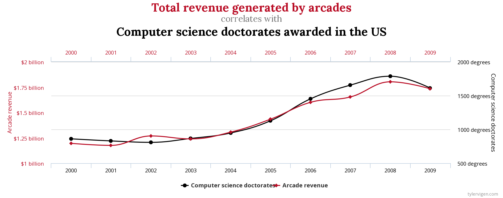

It is human nature to be intrigued and motivated by case studies and real examples to which we feel a connection.  Certainly, the plethora of books and articles in the popular data science literature are likely what motivated many of us to choose to become data scientists and statisticians.  Wanting to know more or to know why encourages us to dive into the theory, and novel teaching or research projects can develop.

The ethics of data science is no different than any other topic we would cover in our classes.  The more compelling the case study, the more engaging the conversation around the ethical topic can be.  In recent years, we have found ourselves awash in materials that provide excellent readings for classroom discussions or peer-to-peer bookclubs.

Below, we provide a handful of suggestions for reading with your students or your colleagues.  We then suggest different ways to continue the conversation by [asking good questions](https://askgoodquestions.blog/).

## Inspiring Curiosity and Skepticism

After a while, "Correlation does not imply causation" can feel pretty tired. Additionally, as the world becomes more data-driven, the ethical dilemmas and nuanced data analysis conclusions require expanded classroom time.  The following books, articles, and projects provide a wealth of examples describing many different case studies which will surely keep everyone engaged.

* [**Algorithms of Oppression**](http://algorithmsofoppression.com/) by Safiya Noble
{ width=80% }  

* [**Automating Inequality**](https://virginia-eubanks.com/books/) by Virginia Eubanks  

* [**Race After Technology**](https://www.ruhabenjamin.com/race-after-technology) by Ruha Benjamin

* [**Artificial Unintelligence**](https://mitpress.mit.edu/books/artificial-unintelligence) by Meredith Broussard  

* [Algorithmic Justice League](https://www.ajl.org/) founded by Joy Buolamwini

* [*Machine Bias*](https://www.propublica.org/article/machine-bias-risk-assessments-in-criminal-sentencing) by Julia Angwin, Jeff Larson, Surya Mattu, and Lauren Kirchner at the time at ProPublica

* [**Indigenous Statistics**](https://www.taylorfrancis.com/books/e/9781315426570) by Maggie Walter and Chris Andersen

* [**Thinking Fast and Slow**](https://us.macmillan.com/books/9780374533557) by Daniel Kahneman

* [**Weapons of Math Destruction**](https://weaponsofmathdestructionbook.com/) by Cathy O'Neil  

* [**Freakonomics**](https://freakonomics.com/) by Steven D. Levitt and Stephen J. Dubner

* [Spurious Correlations](https://www.tylervigen.com/spurious-correlations)

{ width=60% }  

* [**Data Feminism**](https://datafeminism.io/) by Catherine D'Ignazio and Lauren Klein  [Also, heads up:  the idea for a bookclub came from their [Data Feminism Reading Group](http://datafeminism.io/blog/book/data-feminism-reading-group/) which we plan to highlight in a different blog entry.]

## Learning to Ask Good Questions

If you are reading this blog, you are likely already thinking about issues in ethical data science.  One question you might have, however, is how do you bring the case studies into the classroom for interesting ethical discussions.  I'll repeat the motto of a long-time mentor (now also friend and colleague), Allan Rossman: "Ask Good Questions." Asking good questions to our students and training them to also ask good questions will create an environment of quality evidence-based decision making.

### Data Questions for the Classroom

Data are at the heart of a vast number of fields, by definition whenever empirical research is done. Essential to the process of expanding what we know are the following questions:

- **Source:** Where do the data come from?
- **Collection:** How were the data collected? What was the data generation process? 
- **Population:** What population do the data represent?  What population are the data claiming to represent?
- **Use:** Are the conclusions based on the data fair and accurate with respect to the above questions?

As simple as these questions might *seem* to be, it's more critical than ever to understand the data, where they come from, and how they are being used for decisions. Instead of only reporting the experimental design, ask whether subject consent was required and obtained? Do the data reveal relationships that we actually want to avoid propagating (e.g. systemic bias against historically marginalized groups)?

### Algorithm Questions for the Classroom

Data science includes not just data but also models and algorithms.  Typical training of a data scientist includes scrutiny of parameters or optimization criteria for a given model.  But we must also include a discussion of how the optimization criteria chosen may impact groups of people differentially.  For example, a model that is optimized for overall accuracy may have a much higher false positive rate for some groups and false negative rate for other groups.  Some questions to bring up as you discuss the case studies in the readings above include:

- Who is **building** the algorithm?
- Who is **affected** by the algorithm?  Are there any differential **power** dynamics between those who create the algorithm and those who are impacted by it?
- What is the relationship between the **training** data and the **test** or **future** data?
- What was the **optimization** criterion(ia) used to fit the model?

As data scientists we have the wonderful privilege and great responsibility to assist with and validate the answers to these questions. As data science educators it is incumbent on us to build questions into every encounter our students have with data. The beauty lies in the fact that data ethics can be a persistent topic and theme of a course via these questions (and more) as opposed to a dedicated day or module.

### Additional readings in Ethical Data Science

1. A course at the University of Utah by Suresh Venkatasubramanian:

[https://utah.instructure.com/courses/462398/assignments/syllabus](https://utah.instructure.com/courses/462398/assignments/syllabus)

2. An excellent reading list compiled by Jared Knowles:

[https://www.civilytics.com/publication/ethical-data-sci/](https://www.civilytics.com/publication/ethical-data-sci/)

3. *Data Feminism* Reading Group (videos still posted):

[http://datafeminism.io/blog/book/data-feminism-reading-group/](http://datafeminism.io/blog/book/data-feminism-reading-group/)

Are there ideas that you've successfully used to teach about data ethics in the classroom?  Are there instructional practices that you've found helpful?  Valuable articles or resources to share?  We would welcome suggestions in the comments below!

## About this blog

Last summer we wrote a series of blog entries designed to start conversations around teaching data science, [Teach Data Science](https://teachdatascience.com/).  We covered topics such as data science software, data ingestation, data technologies, data wrangling, visualization & exploration, communication, and key reports and findings on data science.

One key element that was lacking on our 2019 blog was a discussion about and a commitment to teaching the ethical aspects of data science.  We have now found ourselves in the summer of 2020, overwhelmed by the state of the world and re-committed to the ethical challenges which can help data science be a positive force for change.

Although none of us are experts in ethics, we have all included ethics discussions in our classrooms for many years.  In the weeks to come, we will share some of the ways we engage our students in these important topics.  We will provide resources for readings, examples, datasets, and exercises.  We believe that data ethics are part of every data science analysis and classroom experience, and we hope that this summer's blog will entice you into presenting ethical dilemmas and related conversations to your students early and often.

During the summer of 2020, we plan to write a dozen blog entries starting on Monday, July 6th.  We hope that you bookmark the site and check in regularly.  Want a reminder?  Sign up for emails at https://groups.google.com/forum/#!forum/teach-data-science (you must be logged into Google to sign up).

