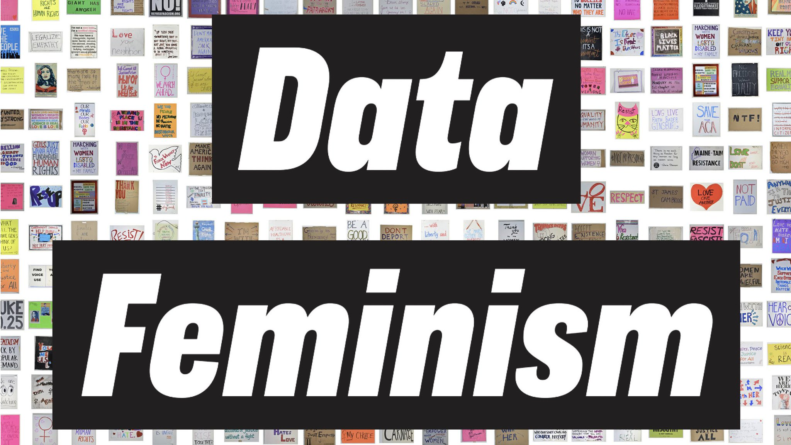
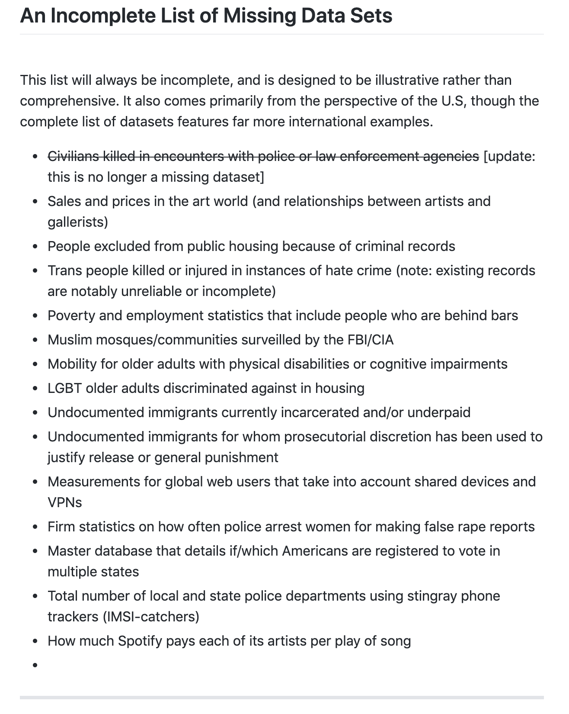

```{r setup, include=FALSE}
knitr::opts_chunk$set(collapse = TRUE)
```

Earlier this week, we [blogged about using books](https://teachdatascience.com/bookclub/) that are full of fantastic examples to generate discussion questions for the classroom and for your own engagement in data science ethics.  The idea for the entry came from the [Data Feminism Reading Group](http://datafeminism.io/blog/book/data-feminism-reading-group/) which met for nine weeks starting in April 17, 2020 to discuss [**Data Feminism**](https://datafeminism.io/) by Catherine D'Ignazio and Lauren Klein.  Each week the authors presented a few ideas from a single chapter, and then they took questions from the group for discussion. 

Both the book and the bookclub discussion are fantastic.  They bring up ideas and case studies which challenge the status quo and focuses data and data science into a larger framework.  They push us to think about:

* data science *by whom*?  
* data science *for whom*?  
* data science *with whose interests and goals*?

{ width=60% }

## Data Feminism vs Data Ethics

One reason we chose to highlight the work of D'Ignazio and Klein today is that they push us beyond examples of data science ethical dilemmas toward an understanding of larger systems and power.  In one of their reading group discussions, they spell out some important aspects of Data Feminism:

> Data Feminism...  
> * is data science that exposes and challenges power, and the intersecting oppressions that result.  
> * is led by and centers minoritized people.  
> * can be a counter data science about the injustices created by mainstream data science.  
> * looks at many axes of inequality - including gender, race, class, and more.  
> * considers process - how inequality permeates all stages of a data science project, from funding to deployment.  
> * credits labor - acknowledges how data science is the work of many hands.  


One way to think about the difference between data feminism and other work in data ethics is that often data ethics tries to solve a problem at hand -- focusing on a particular situation or scenarios, maybe after the fact.  Data feminism focuses on the structural problems that contributed to ethical dilemma in the first place.  If you are concerned with data ethics, it is important to step back and think about how the systems and people involved are situated in the world.  How can we change the structures instead of providing patches for individual cases. 

Not only does the book provide a wealth of information and ideas to think about, but we applaud Catherine and Lauren for embracing the time of quarantine and the way that we can connect with each other virtually. The zoom calls, Q&A sessions, and [recorded videos](http://datafeminism.io/blog/book/data-feminism-reading-group/) bring out some of the best of making virtual connections, and we appreciate the model for how to engage during this time when we are unable to connect in person.    

## Missing Data

In chapter 1 of the book, I was particularly taken by the introduction and discussion about an art project produced by Mimi Onuoha to catalog the [Library of Missing Datasets](http://mimionuoha.com/the-library-of-missing-datasets).  Along with the art she has produced (see her website linked above), she also maintains a GitHub repository which includes important datasets that do not exist.  She implores us (and our students) to ask about the missing data:

* Why do they matter?
* Why are the missing?


{ width=60% }


Reading and discussing **Data Feminism** goes well beyond finding good data science ethics examples for the classroom.  Instead, the text pushes all of us to think about data science in a much broader societal context.  Thank you to Catherine D'Ignazio and Lauren Klein for writing their book!


### Learn more

* Catherine D'Ignazio's [website](http://www.kanarinka.com/)

* Lauren Klein's [website](https://lklein.com/)

* Lauren Klein's course [Feminist Data Science](https://github.com/laurenfklein/feminist-data-science) at MIT.

* Miles Ott taught with **Data Feminism** in the Smith College Statistics and Data Science capstone course.  He detailed the experience in a [fantastic blog post](https://milesott.com/2020/05/11/teaching-data-feminism-to-data-science-students/)


### About this blog 

Last summer we wrote a series of blog entries designed to start conversations around teaching data science, [Teach Data Science](https://teachdatascience.com/).  We covered topics such as data science software, data ingestation, data technologies, data wrangling, visualization & exploration, communication, and key reports and findings on data science.

One key element that was lacking on our 2019 blog was a discussion about and a commitment to teaching the ethical aspects of data science.  We have now found ourselves in the summer of 2020, overwhelmed by the state of the world and re-committed to the ethical challenges which can help data science be a positive force for change.

Although none of us are experts in ethics, we have all included ethics discussions in our classrooms for many years.  In the weeks to come, we will share some of the ways we engage our students in these important topics.  We will provide resources for readings, examples, datasets, and exercises.  We believe that data ethics are part of every data science analysis and classroom experience, and we hope that this summer's blog will entice you into presenting ethical dilemmas and related conversations to your students early and often.

During the summer of 2020, we plan to write a dozen blog entries starting on Monday, July 6th.  We hope that you bookmark the site and check in regularly.  Want a reminder?  Sign up for emails at https://groups.google.com/forum/#!forum/teach-data-science (you must be logged into Google to sign up).
