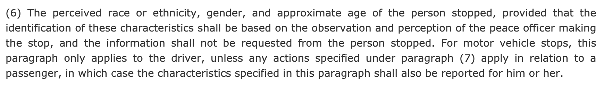
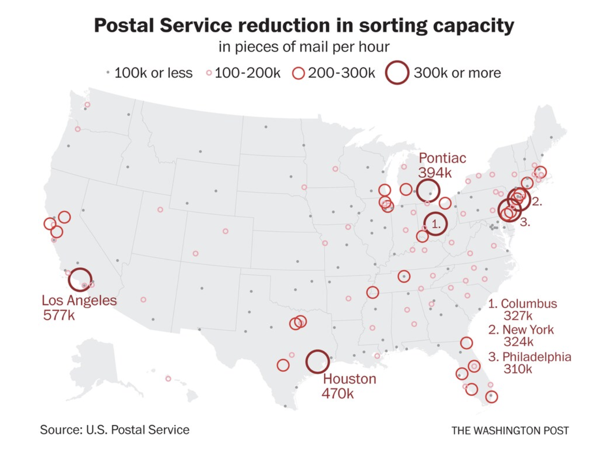

```{r setup, include=FALSE}
knitr::opts_chunk$set(collapse = TRUE)
```


Today's blog is a compilation of datasets and data sources to use in a data science classroom whose goals are to include relevant and timely information to consider issues of the day.  We hope that the datasets below can be used in conjunction with some of this summer's **previous blogs**, for example, considering   

* [health implications when describing COVID data](https://teachdatascience.com/covid/),   
* [language around describing social justice data](https://teachdatascience.com/socialjustice/), and   
* [learning outcomes for getting the most out of ethical data science discussions](https://teachdatascience.com/guidelines/). 

## Collecting Data

Before linking to the data, we encourage you to <span style = "color:red;"> reflect on how data are collected </span> and what impact poor data collection can have on any ensuing conclusions.

* In criminal justice datasets race designation is often a guess of the reporting officer.  Consider [California Assembly Bill No. 953](https://leginfo.legislature.ca.gov/faces/billNavClient.xhtml?bill_id=201520160AB953) from 2015:

<center>
{ width=80% }
</center>


* In their Data Equity Framework, [We All Count](https://weallcount.com/the-data-process/) details seven stages of looking at data projects, including data collection & sourcing.  
<br>

<center>
](weallcount.png){ width=40% }
</center>

<br>

They say: 
 
> The requirements for equitable data collection are complex. It’s not as simple as trying to ask everyone and not leave people out. Sample selection is important of course, but so is survey design, collector behaviour, scope and scale, cultural translation, collection mediums, data corruption, compatibility and fidelity and much more. It’s super worth doing, if for no other reason than your data will be more useful.  


* Christina Abraham discusses the impact of [over-simplifying racial categories](https://www.publichealth.columbia.edu/public-health-now/news/plea-improve-data-collection?utm_medium=social&utm_source=linkedin&utm_campaign=christinaabraham_sv&utm_term=christinaabraham_sv).

* The Schusterman Family Foundation writes about [How we collect data determines whose voice is heard](https://www.schusterman.org/blogs/rella-kaplowitz/how-we-collect-data-determines-whose-voice-is-heard) and has provided guidance on [More Than Numbers: A Guide Toward Diversity, Equity and Inclusion in Data Collection](https://cloudspn.tfaforms.net/266232).

* Researchers at the Urban Institute have put together a report on [The Alarming Lack of Data on Latinos in the Criminal Justice System](https://apps.urban.org/features/latino-criminal-justice-data/).

# Datasets

## Criminal Justice

* Campaign Zero has created the [Police Scorecard Data](https://policescorecard.org/about) to evaluate how police departments interact with the communities they serve.

* The [Stanford Open Policing Project](https://openpolicing.stanford.edu/) provides information on over 200 million traffic stops across 42 states.

* The [Citizens Police Data Project](https://cpdp.co/) collects and publishes information about police misconduct in Chicago.

* [The Police Data Initiative](https://www.policedatainitiative.org/datasets/) promotes responsible policing through the use of open data.

* The [National Archive of Criminal Justice Data](https://www.icpsr.umich.edu/web/pages/NACJD/) curates data on criminal justice, with close to 3,000 studies / datasets.

* ProPublica has compiled [datasets related to criminal justice](https://www.propublica.org/datastore/datasets/criminal-justice) on a wealth of issues:
   - [Civilian Complaints Against New York City Police Officers](https://www.propublica.org/datastore/dataset/civilian-complaints-against-new-york-city-police-officers).
   - [Immigration and Customs Enforcement Arrest Data (2013-2017)](https://www.propublica.org/datastore/dataset/immigration-and-customs-enforcement-arrest-data-2013-2017).
   - [COMPAS Recidivism Risk Score Data and Analysis](https://www.propublica.org/datastore/dataset/compas-recidivism-risk-score-data-and-analysis).
   
* The data from [Five Thirty Eight](https://github.com/fivethirtyeight/data) includes many studies related to criminal justice:
  - [Hate crimes](https://github.com/fivethirtyeight/data/tree/master/hate-crimes).
  - [Police deaths](https://github.com/fivethirtyeight/data/tree/master/police-deaths).
  - [Police killings](https://github.com/fivethirtyeight/data/tree/master/police-killings).
  - [Police residence](https://github.com/fivethirtyeight/data/tree/master/police-locals).
   
   
## Environment

* ProPublica has compiled [datasets related to the environment](https://www.propublica.org/datastore/datasets/environment) including:
  - [Defense Environmental Restoration Program Sites](https://www.propublica.org/datastore/dataset/defense-environmental-restoration-program-military-cleanup-sites).
  - [Harris County Flood Control District Buyout Data](https://www.propublica.org/datastore/dataset/houston-flood-buyouts).

* Pulitzer-winning Washington Post series on [Dangerous new hot zones are spreading around the world](https://www.washingtonpost.com/graphics/2019/national/climate-environment/climate-change-world/?itid=lk_inline_manual_1) with [data sources and explanation of the data](https://www.washingtonpost.com/climate-environment/2020/08/07/how-use-posts-climate-data-analysis/).

## Health

* ProPublica has compiled [datasets related to health](https://www.propublica.org/datastore/datasets/health) including:
  - [Clinical Trials: Participant Demographic Data](https://www.propublica.org/datastore/dataset/cancer-clinical-trials-demographics-data).
  - [Hospital Bed Capacity and COVID-19](https://www.propublica.org/datastore/dataset/hospital-bed-capacity-and-covid-19).


## Race & gender

* Tidy Tuesday dataset on [African American Achievements](https://github.com/rfordatascience/tidytuesday/blob/master/data/2020/2020-06-09/readme.md).

* Tidy Tuesday dataset on the [Slave trade](https://github.com/rfordatascience/tidytuesday/tree/master/data/2020/2020-06-16).

* [Racial bias](https://www.pastemagazine.com/soccer/troubling-evidence-of-implicit-racial-bias-in-mls/) in red cards given in Major League Soccer, with [data provided](https://onedrive.live.com/view.aspx?resid=1EFC64991E6F25EF!128&ithint=file%2cxlsx&authkey=!AHWxihA_GnTJoIA).

* An experiment done with names on resumes to measure [racial discrimination in the labor market](https://www.nber.org/papers/w9873) with data summarized nicely by [OpenIntro](https://www.openintro.org/data/index.php?data=resume).


* [Center for American Women and Politics](https://cawp.rutgers.edu) posted the entire [Women Elected Officials Database](https://cawpdata.rutgers.edu/).

* Measuring stereotypical bias in language models with an [applicartion](https://stereoset.mit.edu/) and [reproducible code](
https://stereoset.mit.edu/).

* [Southern Poverty Law Center](https://www.splcenter.org/) mapping information on [Confederate monuments](https://docs.google.com/spreadsheets/d/1W4H2qa2THM1ni53QYZftGob_k_Bf9HreFAtCERfjCIU/edit?pli=1#gid=1205021846).

* [Mitigating gender bias in student evaluations of teaching](https://journals.plos.org/plosone/article?id=10.1371/journal.pone.0216241) including [data](https://dataverse.harvard.edu/dataset.xhtml?persistentId=doi:10.7910/DVN/AB4ZAV).

## Elections

* Issues with [mail in ballots](https://medium.com/@ElectProject/mail-balloting-in-the-classroom-9b7f36e7594f) including [GA data](https://elections.sos.ga.gov/Elections/voterabsenteefile.do) and [NC data](https://dl.ncsbe.gov/?prefix=ENRS/2020_11_03/).

* Washington Post article on [Postal Service warns 46 states their voters could be disenfranchised by delayed mail-in ballots](https://washingtonpost.com/local/md-politics/usps-states-delayed-mail-in-ballots/2020/08/14/64bf3c3c-dcc7-11ea-8051-d5f887d73381_story.html).  Jacob Bogage is collecting data and will [likely post it publicly](https://twitter.com/jacobbogage/status/1294814447303786497?s=20).

<center>
{ width=60% }
</center>


* [Voter registration](https://fivethirtyeight.com/features/voter-registrations-are-way-way-down-during-the-pandemic/) during the pandemic, including [data on new voter registration](https://github.com/fivethirtyeight/data/tree/master/voter-registration).


## Large Data Archives

* [DrivenData](https://www.drivendata.org/competitions/) crowd-sources solving data science problems with positive social impact.

* [Data is Plural](https://tinyletter.com/data-is-plural/archive) has compiled over a [thousand datasets](https://docs.google.com/spreadsheets/d/1wZhPLMCHKJvwOkP4juclhjFgqIY8fQFMemwKL2c64vk/edit#gid=0) on every topic imaginable.

* [The Markup](https://themarkup.org/) uses data-driven approaches to investigate how powerful institutions use technology, often against our best interest.  All [Markup data](https://github.com/the-markup) is freely available.

* [FiveThirtyEight](https://fivethirtyeight.com/) is a data journalism website which started by doing political analyses but now uses data to cover politics, science, economics, and lifestyle.  They provide access to [many of their datasets](https://github.com/fivethirtyeight/data).

* [ProPublica](https://www.propublica.org/) does investigative journalism and provides many of [their datasets for free](https://www.propublica.org/datastore/datasets/).

### About this blog 

Last summer we wrote a series of blog entries designed to start conversations around teaching data science, [Teach Data Science](https://teachdatascience.com/).  We covered topics such as data science software, data ingestation, data technologies, data wrangling, visualization & exploration, communication, and key reports and findings on data science.

One key element that was lacking on our 2019 blog was a discussion about and a commitment to teaching the ethical aspects of data science.  We have now found ourselves in the summer of 2020, overwhelmed by the state of the world and re-committed to the ethical challenges which can help data science be a positive force for change.

Although none of us are experts in ethics, we have all included ethics discussions in our classrooms for many years.  In the weeks to come, we will share some of the ways we engage our students in these important topics.  We will provide resources for readings, examples, datasets, and exercises.  We believe that data ethics are part of every data science analysis and classroom experience, and we hope that this summer's blog will entice you into presenting ethical dilemmas and related conversations to your students early and often.

During the summer of 2020, we wrote a dozen or so blog entries.  We hope that you bookmark the site and check in regularly.  Want a reminder?  Sign up for emails at https://groups.google.com/forum/#!forum/teach-data-science (you must be logged into Google to sign up).
