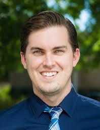
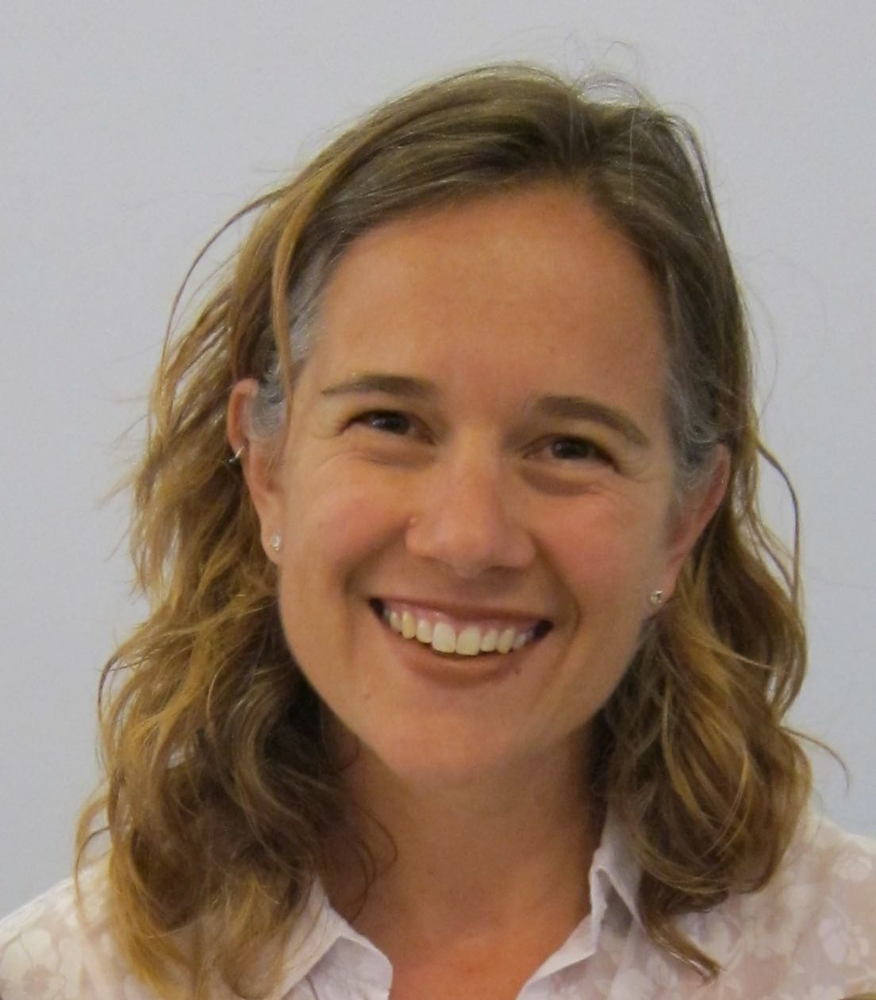
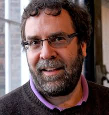

```{r setup, include=FALSE}
knitr::opts_chunk$set(collapse = TRUE)
```


2020 has been a tough year, and the summer has been no different.  In so many ways, we feel defeated, overwhelmed, and worried about the world around us.  However, this summer's blog entries on infusing ethics into data science education has provided a small respite for using our data science classrooms as positive forces in these turbulent times.

Through writing the blog entries we have honed our own perspectives and gained tools for bringing ethics into the classroom.  We hope that the entries have been useful for you, as well.  We recognize that each of us is in our own space right now, especially this year!, and we hope the entries have been broad enough to support teachers and learners in all different places.

As a way of summarizing, we've provided an organization of the entire list of blog entries focused on data science ethics.  We have included a few entries from last summer, designated by (2019).  

##  What topics did the blog cover?

- curricula and structure
  - [Re-Introduction: Ethics in Data Science Education](https://teachdatascience.com/reintro/)
  - [Keeping Busy with Data Science](https://teachdatascience.com/keepbusy/)
  - [Integrating ethics training into any quantitative course](https://teachdatascience.com/guidelines/)
  - [Roundtable on Data Science Post Secondary Education](https://teachdatascience.com/dsert/) (2019)
  - [Data Science for Undergraduates](https://teachdatascience.com/nasem/) (2019)


- data sets and case studies
  - [Engaging data science students with COVID-19 data](https://teachdatascience.com/covid/)
  - [Social Justice & Data Science](https://teachdatascience.com/socialjustice/)
  - [Data Sources](https://teachdatascience.com/datasources/)
  - [Ethical Data Viz](https://teachdatascience.com/ethicaldataviz/)
  - [Data Science for Good](https://teachdatascience.com/data4good/) (2019)
  - [Algorithmic Bias](https://teachdatascience.com/algbias/) (2019)
  

- philosophy
  - [Philosophical Ethics for Data Science](https://teachdatascience.com/philosophy/)
  - [Hippocratic Oath](https://teachdatascience.com/oath/)
  - [Data Privacy](https://teachdatascience.com/privacy/)


- discourse
  - [Bookclub on Data Science Ethics](https://teachdatascience.com/bookclub/)
  - [Data Feminism](https://teachdatascience.com/datafem/)
  - [A preview of the JSM](https://teachdatascience.com/jsm/), with focus on ethics relates session in 2020
  - [Diversity in Data Science & Statistics](https://teachdatascience.com/diversity/) (2019)

## Ethics Courses

To conclude summer 2020, we provide links to courses on Data Science Ethics.  We hope that with the following resources and the ideas from the summer blog entries, you will be able to bring ideas of ethics into all of your data science courses.  If it feels daunting, try one small thing.  Bring up an idea that you find compelling.  Help the students see what you see when you look at the ethical components of the data analysis.  And enjoy.

- [Fairness in Machine Learning](https://fairmlclass.github.io/) at UC Berkeley
- [Data Science Ethics](https://datascienceethics.org/the-course/) at Yale
- [Responsible Data Science](https://dataresponsibly.github.io/courses/spring19/) at NYU
- [Applied Data Ethics](https://www.fast.ai/2020/08/19/data-ethics/) on fast.ai


##  Who are we?



**[Hunter Glanz](https://statistics.calpoly.edu/hunter-glanz)** ([twitter](https://twitter.com/hglanz)) is an Associate Professor of Statistics and Data Science at California Polytechnic State University (Cal Poly, San Luis Obispo). He received a BS in Mathematics and a BS in Statistics from Cal Poly, San Luis Obispo followed by an MA and PhD in Statistics from Boston University. He maintains a passion for machine learning and statistical computing, and enjoys advancing education efforts in these areas. In particular, Cal Poly's courses in R, SAS, and Python give him the opportunity to connect students with exciting data science topics amidst a firm grounding in communication of statistical ideas. Hunter serves on numerous committees and organizations dedicated to delivering cutting edge statistical and data science content to students and professionals alike. In particular, the ASA's DataFest event at UCLA has been an extremely rewarding experience for the teams of Cal Poly students Hunter has had the pleasure of advising.




**[Jo Hardin](https://www.pomona.edu/directory/people/johanna-s-hardin)** ([twitter](https://twitter.com/jo_hardin47)) is a statistician at Pomona College who is passionate about statistics and data science education for all.   She received her BA from Pomona College and her MS and PhD degrees from the University of California, Davis.  Two years of working at the Fred Hutchinson Cancer Research Center in Seattle, WA got her hooked into analyzing high throughput data (e.g., simultaneous gene expression of thousands of genes).   Much of her theoretical work has focused on computational approaches to  statistical problems in genetics.  Jo works hard to provide her students with current best practices, including teaching the `tidyverse` to her students in Introduction to Statistics.  Beyond the classroom, she has also worked to engage students in statistics and data science: she has worked on the ASA's curriculum guidelines task force, sent groups of students to UCLA's DataFest competition, and hosted a local StatFest conference.  Through her endeavors, she is working to help undergraduates learn about analyzing data in the wild and gain the skills to be effective and ethical when tasked with making claims from data.  This fall she will be teaching statistics inside the California Rehabilitation Center through the international [Inside-Out Prison Exchange Program](http://www.insideoutcenter.org/).




**[Nick Horton](https://www.amherst.edu/people/facstaff/nhorton)** ([twitter](https://twitter.com/askdrstats)) is Beitzel Professor of Technology and Society and Professor of Statistics and Data Science at Amherst College. His recent work has focused on statistics and data science education.  Nick is a fellow of the American Statistical Association and the American Association for the Advancement of Science. He chaired the Committee of Presidents of Statistical Societies and the ASA Curriculum Guidelines for Undergraduate Programs in Statistical Science workgroup.  Nick serves on the National Academies Committee for Applied and Theoretical Statistics and is a co-author of the 2018 "[Undergraduate Data Science: Opportunities and Options](https://nas.edu/envisioningds)" consensus study report and the ASA's revised GAISE ([Guidelines for Assessment and Instruction in Statistics Education](https://www.amstat.org/asa/education/Guidelines-for-Assessment-and-Instruction-in-Statistics-Education-Reports.aspx)) College report.
