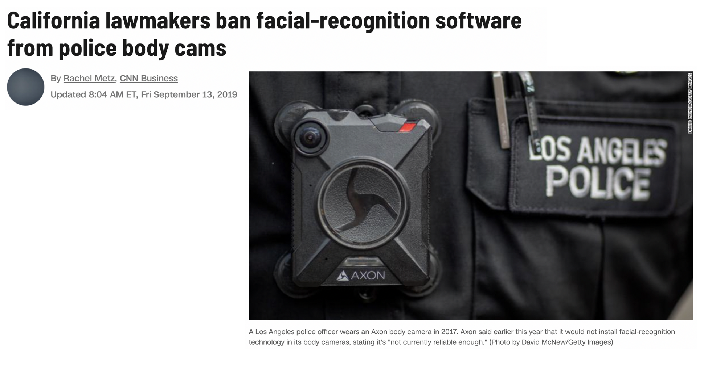
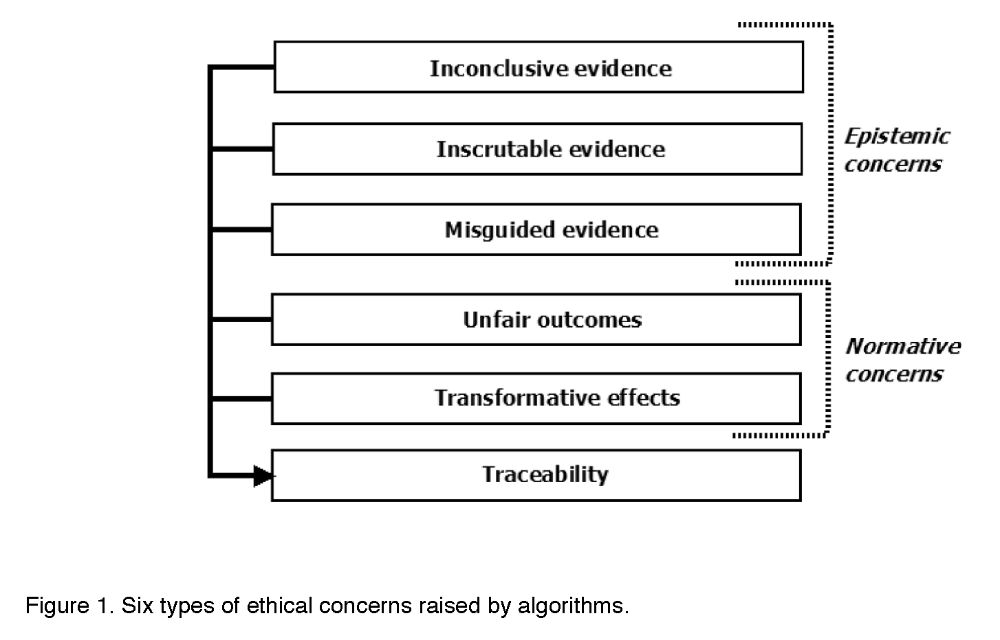

```{r setup, include=FALSE}
knitr::opts_chunk$set(collapse = TRUE)
```

In philosophy departments, classes and modules centered around data ethics are not a new thing.  The ethical challenges around working with data are not fundamentally different from the ethical challenges philosophers have always faced.  But putting an ethical framework around data science principles (see [here](https://plato.stanford.edu/entries/ethics-computer/) and [here](https://plato.stanford.edu/entries/ethics-internet-research/)) is indeed **new for most data scientists**, and for many of us, we are woefully under-prepared to teach so far outside our comfort zone.

We start with a grounding in the definition of Ethics:

> **Ethics**, also called **moral philosophy**, has three main branches:

> [**Applied ethics**](https://www.oxfordbibliographies.com/view/document/obo-9780195396577/obo-9780195396577-0006.xml) "is a branch of ethics devoted to the treatment of moral problems, practices, and policies in personal life, professions, technology, and government."

> [**Ethical theory**](https://www.oxfordhandbooks.com/view/10.1093/oxfordhb/9780199234769.001.0001/oxfordhb-9780199234769-e-2) "is concerned with the articulation and the justification of the fundamental principles that govern the issues of how we should live and what we morally ought to do. Its most general concerns are providing an account of moral evaluation and, possibly, articulating a decision procedure to guide moral action."

> [**Metaethics**](https://plato.stanford.edu/entries/metaethics/) "is the attempt to understand the metaphysical, epistemological, semantic, and psychological, presuppositions and commitments of moral thought, talk, and practice." 

While, unfortunately, there are myriad examples of ethical data science problems (see, for example, blog posts [bookclub](https://teachdatascience.com/bookclub/) and [data feminism](https://teachdatascience.com/datafem/)), today's entry connects some of the broader data science ethics issues with the existing philosophical literature.  We point out that we are only scratching the surface and a deeper dive might involve education in related philosophical fields (epistemology, metaphysics, or philosophy of science), philosophical methodologies, and ethical schools of thought. You can peruse all of these through, for example, a course or readings introducing the discipline of philosophy. Indeed, maybe this blog post will whet your appetite to create a vital interdisciplinary bridge (here between philosophy and data science) which can only enhance both fields.

Below we provide some thoughts on how to approach a data science problem using a philosophical lens.  

## Case Study to Structure Ethical Discussion

Many ethics case studies provided in a classroom setting describe algorithms built on data which are meant to predict outcomes.  Large scale algorithmic decision making presents particular ethical predicaments because of both the scale of impact and the "black-box" sense of how the algorithm is generating predictions. 


Consider the well-known issue of using facial recognition software in policing. There are many questions surrounding the policing issue:  what are the action options with respect to the outcome of the algorithm?  What are the good and bad aspects of each action and how are these to be weighed against each other? 




The two main ethical concerns surrounding facial recognition software break down into how the algorithms were developed and how the algorithm is used.  When thinking about the questions below, reflect on the good aspects and the bad aspects and how one might weight the good versus the bad.

#### Creating the algorithm
* What data should be used?
  - If the accuracy rates of the algorithm differ based on the demographics of the subgroups within the data, is more data and testing required?
  
* Who and what criteria should be used to tune the algorithm?
  - Who should be involved in decisions on the tuning parameters of the algorithm?
  - Which optimization criteria should be used (e.g., accuracy? false positive rate? false negative rate?)
  

* Issues of access:
  - Who should own or have control of the facial image data?  
       - Do individuals have a right to keep their facial image private from being in databases?  
       - Do individuals have a right to be notified that their facial image is in the data base? For example, if I ring someone’s doorbell and my face is captured in a database, do I need to be told? [While traditional human subjects and IRB requirements necessitate consent to be included in any research project, in most cases it is legal to photograph a person without their consent.]  
  - Should the data be accessible to researchers working to make the field more equitable?  What if allowing accessibility thereby makes the data accessible to bad actors?


#### Using the algorithm

* Issues of personal impact:
  - The software might make it easier to accurately associate an individual with a crime, but it might also make it easier to *mistakenly* associate an individual with a crime.  How should the pro vs con be weighed against each other?
  - Do individuals have a right to know, correct, or delete personal information included in a database?
  

* Issues of societal impact:
  - Is it permissible to use a facial recognition software which has been trained primarily on Caucasian faces, given that this results in false positive and false negative rates that are not equally dispersed across racial lines?
  - While the software might make it easier to protect against criminal activity, it also makes it easier to undermine specific communities when their members are mistakenly identified with criminal activity.  How should the pro vs con of different communities be weighed against each other?
  
* Issues of money:
  - Is it permissible for a software company to profit from an algorithm while having no financial responsibility for its misuse or negative impacts?
  - Who should pay the court fees and missed work hours of those who were mistakenly accused of crimes?


To settle the questions above, we need to study various ethical theories, and it turns out that the different theories may lead us to different conclusions.  As non-philosophers, we recognize that the suggested readings and ideas may come across as overwhelming.  If you are overwhelmed, we suggest that you choose one ethical theory, think carefully about how it informs decision making, and help your students to connect the ethical framework to a data science case study. 

<!--Mittelstadt et al. (2016) break down parts of the algorithmic decision-making process as belonging to two sets of ethical concerns: epistemic and normative.

{ width=60% }


Their organizing structure given above takes into account that algorithms:

> (1) turn data into evidence for a given outcome (henceforth
conclusion), and that this outcome is then used to 
> (2) trigger and motivate an action that (on its own, or when
combined with other actions) may not be ethically neutral. This work is performed in ways that are complex and (semi-)autonomous, which 
> (3) complicates apportionment of responsibility for effects of actions driven by algorithms.

-->


## Some Readings in Philosophy

In order to break down the algorithmic steps outlined above, students probably need some grounding in ethical structures.  You might choose to use only one of the following as a lens to investigate an ethical case study.  Alternatively, you may provide snippets from a variety of sources and compare how the different ethical frameworks would inform the algorithmic decisions.

* [Epistemic Logic](https://plato.stanford.edu/entries/logic-epistemic/) centers around knowing through a sequence of implications from one step to the next. 
  - Boaz Miller and Isaac Record [Justified Belief in a Digital Age: on the epistemic implications of secret internet technologies](https://www.cambridge.org/core/journals/episteme/article/justified-belief-in-a-digital-age-on-the-epistemic-implications-of-secret-internet-technologies/5E6041428F4876B8BA2A8EF424AE6CF6)  *Privacy, Secrecy, and Epistemology*, 2013.  
  
*  [Ethical Theories](https://en.wikipedia.org/wiki/Normative_ethics) are different foundational frameworks for answering such questions as what is morally right and wrong.  
    - [Virtue ethics](https://plato.stanford.edu/entries/ethics-virtue/): 
        - Julia Annas [Virtue Ethics](https://www.oxfordhandbooks.com/view/10.1093/oxfordhb/9780195325911.001.0001/oxfordhb-9780195325911-e-19)
 
    - [Kantian ethics](https://plato.stanford.edu/entries/kant-moral/)
         - Christine Korsgaard [The Sources of Normativity](https://www.cambridge.org/core/books/sources-of-normativity/5A85034A6566FDFDE374073A015CBD2A)   
         - Barbara Herman [The Practice of Moral Judgment](https://www.hup.harvard.edu/catalog.php?isbn=9780674697188)  


 
   - [Consequentialism](https://plato.stanford.edu/entries/consequentialism/): 
       - Utilitarianism originated from work from [Mill and Bentham](https://www.britannica.com/topic/utilitarianism-philosophy), two philosophers & economists who are [compared here](https://peped.org/philosophicalinvestigations/compare-bentham-v-mill38/).  
       - [Utilitarianism: A Very Short Introduction](https://www.veryshortintroductions.com/view/10.1093/actrade/9780198728795.001.0001/actrade-9780198728795), by Katarzyna de Lazari-Radek and Peter Singer  


   - [Deonotological Ethics](https://plato.stanford.edu/entries/ethics-deontological/)

   - [Contractualism](https://plato.stanford.edu/entries/contractualism/)

   - [Feminist Ethics](https://plato.stanford.edu/entries/feminism-ethics/)

<!--
## Making Decisions Based on Algorithms

An understanding of the ethical challenges in data science is one part of the discussion.  The follow-up concerns issues of "what do we do from here?" Ananny (2015) breaks down the follow-up decision making process into three different approaches:

* **deontological**:  based on a set of rules, is the action itself right or wrong?  [Kantian ethics](https://en.wikipedia.org/wiki/Kantian_ethics) provides the structure for deontological ethical theory, requiring a set of moral laws that apply to all people without contradictions.
* **teleological**: based on the consequences of the action and the end goal, what produces the most good? [Teleological](https://en.wikipedia.org/wiki/Teleology) is grounded in the existence of God and highlights an *extrinsic* motivator for decision making.  Much of the work comes from the writings of Plato and Aristotle.
* **virtue**: based on internal moral compass, is the action the "right" thing to do? [Virtue ethics](https://en.wikipedia.org/wiki/Virtue_ethics) characterizes internal characteristics that make the possessor a good person.  Virtues are in contrast to single decisions, actions, or feelings.  Virtue ethics originated with Socrates. In [Meno](https://en.wikipedia.org/wiki/Meno), Socrates works to determine the definition of virtue.   
-->


We note that some of the links above point to reference articles (instead of original or scholarly works).  While we recognize the value in reading original sources, we also have experience in the difficulty of grappling with new philosophical ideas (especially for students in disciplines outside of philosophy or ethics).  If you are using original sources in your classroom that are accessible to data science students, please add the sources to our discussion of this blog, as we are certain that the citations would be much appreciated in the data science community!


### Learn more

* An excellent and comprehensive list of [Readings in Ethical Data Science](https://github.com/jknowles/ethical_data_science_reader/blob/master/Ethical%20and%20Inclusive%20Data%20Science%20Readings.pdf) by Jared Knowles

* Eirini Malliaraki put together a [critical reading list](https://medium.com/@eirinimalliaraki/toward-ethical-transparent-and-fair-ai-ml-a-critical-reading-list-d950e70a70ea) for ethical, transparent, and fair AI/ML.

* Shannon Vallor, [An Introduction to Data Ethics](https://www.scu.edu/media/ethics-center/technology-ethics/IntroToDataEthics.pdf) is a complete text with ethical frameworks and corresponding case studies.

* A compilation of many sets of [course materials](http://aiethics.site/course-materials) for Data Ethics courses across the world.

* Brent Mittelstadt, Patrick Allo, Mariarosaria Taddeo, Sandra Wachter, and Luciano Floridi, [The ethics of algorithms: Mapping the debate](https://journals.sagepub.com/doi/pdf/10.1177/2053951716679679), *Big Data & Society*, 2016.

* Mike Loukides, Hilary Mason, and DJ Patil, [Ethics and Data Science](https://www.oreilly.com/library/view/ethics-and-data/9781492043898/), 2018.

* Thinking beyond Western literature: 
  - [African Ethics](https://plato.stanford.edu/entries/african-ethics/)
  - [Chinese Ethics](https://plato.stanford.edu/entries/ethics-chinese/)
  - Chris Fraser's [work on Mohism](http://cjfraser.net/projects/mohist-thought/)
  - Damien Keown [Buddhist Ethics: A Very Short Introduction](https://global.oup.com/academic/product/buddhist-ethics-a-very-short-introduction-9780192804570?cc=us&lang=en&)


#### Acknowledgements

Thanks much to Julie Tannenbaum and Michael Spezio whose careful reads of previous drafts led to a much improved blog entry.

### About this blog 

Last summer we wrote a series of blog entries designed to start conversations around teaching data science, [Teach Data Science](https://teachdatascience.com/).  We covered topics such as data science software, data ingestation, data technologies, data wrangling, visualization & exploration, communication, and key reports and findings on data science.

One key element that was lacking on our 2019 blog was a discussion about and a commitment to teaching the ethical aspects of data science.  We have now found ourselves in the summer of 2020, overwhelmed by the state of the world and re-committed to the ethical challenges which can help data science be a positive force for change.

Although none of us are experts in ethics, we have all included ethics discussions in our classrooms for many years.  In the weeks to come, we will share some of the ways we engage our students in these important topics.  We will provide resources for readings, examples, datasets, and exercises.  We believe that data ethics are part of every data science analysis and classroom experience, and we hope that this summer's blog will entice you into presenting ethical dilemmas and related conversations to your students early and often.

During the summer of 2020, we plan to write a dozen blog entries.  We hope that you bookmark the site and check in regularly.  Want a reminder?  Sign up for emails at https://groups.google.com/forum/#!forum/teach-data-science (you must be logged into Google to sign up).
