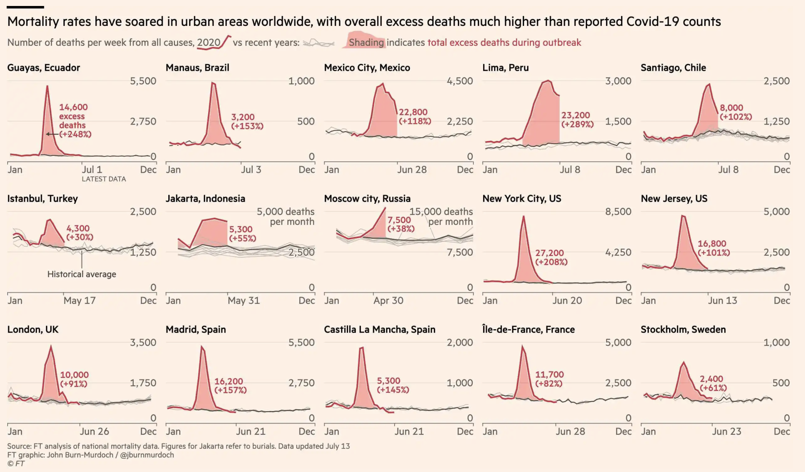

```{r setup, include=FALSE}
knitr::opts_chunk$set(collapse = TRUE)
```


## COVID-19 Case Study

Today we have a guest entry authored by Maria Tackett (Duke University) and 
Mine Çetinkaya-Rundel (University of Edinburgh, RStudio, and Duke) about engaging data science students with COVID-19 data.  They write:

Given the prevalence of data and statistics in many corners of society, it is not hard to find real-world examples that can be used in the classroom. Using real and relevant data can help show students how they apply what they've learned outside of the classroom and it helps students connect what they're learning to what is happening on the news, online, and conversations they're having with their peers.

Though there are benefits to use timely data to help students make these connections, there are some topics and data sets that warrant additional consideration before an instructor uses them in class. One such topic is the COVID-19 pandemic. Since early 2020, there has been a deluge of new data sets, visualizations (good and bad), and statistical models aiming to help the public better understand the pandemic and its impacts. Though this has made it easier to incorporate this topic in statistics classes through in-class examples or data analysis, this could be a challenging topic for students to discuss given the impacts and ongoing effects from the pandemic that may be experienced by some students.

Here we offer a few considerations instructors can make before using COVID-19 data for in-class examples or assignments.

## Take a "trauma-informed" approach

These considerations are based on the 2020 eCOTS panel [*Engaging Students during the COVID-19 Health Crisis*](https://www.causeweb.org/cause/ecots/ecots20/panels/2) by [Laura Le](https://directory.sph.umn.edu/bio/sph-a-z/laura-le), [Kari Lock Morgan](http://www.personal.psu.edu/klm47/), and [Lucy McGowan](https://www.lucymcgowan.com/). One of the primary messages from the panel is that the pedagogy should be "trauma-informed" due to the potential direct impact on students. This approach can help instructors create an environment where students feel safe to discuss this sensitive topic while reducing the risk of retraumatizing students who may be directly impacted by the pandemic.

{ width=70% }


Here are a few practical steps the panelists shared to take a trauma-informed approach when using COVID-19 data in the classroom.

-   Start by taking an anonymous poll asking students whether or not they want to talk about data related to the pandemic in class. If the data will be used multiple times in a semester, it is good to repeat the poll to get point-in-time feedback, since students' feelings may change as the situation around the pandemic evolves.
-   Indicate in the syllabus when data about the pandemic will be used, so students know when to expect the topic to be discussed in class.
-   Create an alternative assignment or discussion prompt for students who do not wish to discuss the pandemic.
-   If the course is designed for a more specialized audience, such as biostatistics or graduate students, the instructor can address the fact that the topic is sensitive but is also an important area of research. This is also an opportunity to talk about strategies for maintaining a healthy relationship with emotions when doing research on sensitive topics.
-   Instructors should be honest about our experience with working with COVID-19 data and, where appropriate, provide a disclaimer that we are not experts in epidemiology and infectious diseases, that we have not done an exhaustive literature review, and that we can't vouch for everyone's models and predictions.

## Focus on other societal impacts

Another approach to incorporating COVID-19 data in the classroom is to use examples that do not focus on direct health outcomes of the pandemic. This was the approach taken at this year's DataFest events, where students were encouraged to analyze a societal impact of the pandemic other than direct health outcomes. Potential topics include

-   How has the pandemic affected the airline industry and what are some potential downstream effects of this other than economic strain on the industry?
-   As a student, how would you quantify the effect of the pandemic on your education?
-   With shelter-in-place / lockdown orders, many workers have started working from home, which requires internet access. How prepared was the nation / your local area for this shift?
-   How has the spread of the pandemic affected people's opinion on government tracking and privacy?
-   What is the effect of the social distancing / shelter-in-place / lockdown recommendations and policies on pollution?
-   How can we quantify the potential effects on nutrition and general health of the public, outside of those affected by the virus?
-   How are refugees affected by COVID-19?

This allows students to still explore data that is timely and relevant to our current moment, while not having to engage with some of the most sensitive data - the direct health outcomes.

For inspiration, check out projects by students who participated in DataFest 2020 in the following institutions:

-   [Duke University](https://www2.stat.duke.edu/datafest-covid19/winners.html)
-   [UCLA](http://datafest.stat.ucla.edu/2020-results/2020-winners/)
-   [University of Edinburgh](http://bit.ly/df-edi)
-   [University of Toronto](https://datafestuoft.github.io/)

## Visualising COVID-19

COVID-19 is the pandemic of data visualisation and infographics. From [\#FlattenTheCurve](https://en.wikipedia.org/wiki/Flattening_the_curve) to the [Washington Post article on exponential spread](https://www.washingtonpost.com/graphics/2020/world/corona-simulator/) to the [pink graphs of the Financial Times](https://www.ft.com/content/a26fbf7e-48f8-11ea-aeb3-955839e06441), we have been consuming these visualisations since the beginning of the outbreak. Some of these data visualisations and infographics have had an extremely important effect on public health awareness and some have been the source of much critique due to how they misrepresent the underlying data.

{ width=70% }

Below are a few ways you can engage students with data visualisations based on COVID-19 data:

-   Critique a data visualisation: You might ask the students to find a visualisation of COVID-19 data, or provide options for them. We recommend not just focusing on visualisations that are clearly bad. We have been collecting visualisations of COVID-19 data [in a GitHub repository](https://github.com/mine-cetinkaya-rundel/covid19-viz), and we hope you will contribute some you think would be good fits for this exercise there as well!

-   Improve a data visualisation: We recently wrote a piece for CHANCE magazine titled "[From Drab to Fab: Teaching Visualization via Incremental Improvements](https://doi.org/10.1080/09332480.2020.1754074)" (you can find an open version of the piece [here](https://github.com/mine-cetinkaya-rundel/take-a-chance/blob/master/2020-02-drab-to-fab/2020-02-drab-to-fab.pdf)). In this piece we describe how to structure a visualisation improvement exercise. This type of exercise could be tagged on to the previous critique exercise, in cases where the raw data is available or can be recreated from the visualisation.

We should note that it is especially important to keep the context, a pandemic that has taken hundreds of thousands lives and turned many others upside down, while working on these data visualisations. Especially when critiquing poorly made data visualisations it's easy to get caught up in the technical errors and how to correct them and lose sight of *why* it's so important for visualisations of COVID-19 data to reflect the truth accurately and communicate it as effectively as possible.

## Data and analysis examples

Visit the websites below to find data, visualizations, class activities, and other resources helpful for teaching. If you have data or examples you'd like to share, you can also contribute to these sites.

-   [Teaching Statistics During the COVID-19 Health Crisis](https://coronavirus-teaching-resources.netlify.app)
-   [covid19-r: Collection of analyses, packages, visualizations of COVID-19 data in R](https://mine-cetinkaya-rundel.github.io/covid19-r/)
-   [Data Is Plural - 2020.07.15 edition](https://tinyletter.com/data-is-plural/letters/data-is-plural-2020-07-15-edition)

## Further reading

-   [Teaching Public Health Will Never Be the Same](https://ajph.aphapublications.org/doi/abs/10.2105/AJPH.2020.305710) by Nadia Abuelezam
-   [Why It's So Freaking Hard To Make A Good COVID-19 Model](https://fivethirtyeight.com/features/why-its-so-freaking-hard-to-make-a-good-covid-19-model) by Maggie Koerth, Laura Bronner, and Jasmine Mithani
-   [Ten Considerations Before You Create Another Chart About COVID-19](https://link.medium.com/cJR6WVlFX7) by Amanda Makulec
-   [Dangerous Numbers? Teaching About Data and Statistics Using the Coronavirus Outbreak](https://www.nytimes.com/2020/02/27/learning/dangerous-numbers-teaching-about-data-and-statistics-using-the-coronavirus-outbreak.html) by Patrick Honner
-   Look forward to our column "Taking the Chance in the Classroom: COVID-19 data in the classroom" in the upcoming volume of [CHANCE](https://www.tandfonline.com/toc/ucha20/current)!


## Bio

This is a guest post by friends of the blog Maria Tackett and Mine Çetinkaya-Rundel.  Maria holds a PhD in Statistics from the University of Virginia and is now an Assistant Professor of the Practice in the Department of Statistical Science at Duke University.  She is active on [twitter](https://twitter.com/MT_statistics) and on [GitHub](https://github.com/matackett).  She can be found at [https://www.mariatackett.net/](https://www.mariatackett.net/).  Mine holds a PhD in Statistics from UCLA and is a Senior Lecturer at University of Edinburgh and a Data Scientist at RStudio.  She [tweets](https://twitter.com/minebocek) and engages regularly on [GitHub](https://github.com/mine-cetinkaya-rundel).  Mine’s [website](http://www2.stat.duke.edu/~mc301/) profiles her work which includes, among other things, her open access textbooks through [OpenIntro](https://www.openintro.org/).


## About this blog

Last summer we wrote a series of blog entries designed to start conversations around teaching data science, [Teach Data Science](https://teachdatascience.com/).  We covered topics such as data science software, data ingestation, data technologies, data wrangling, visualization & exploration, communication, and key reports and findings on data science.

One key element that was lacking on our 2019 blog was a discussion about and a commitment to teaching the ethical aspects of data science.  We have now found ourselves in the summer of 2020, overwhelmed by the state of the world and re-committed to the ethical challenges which can help data science be a positive force for change.

Although none of us are experts in ethics, we have all included ethics discussions in our classrooms for many years.  In the weeks to come, we will share some of the ways we engage our students in these important topics.  We will provide resources for readings, examples, datasets, and exercises.  We believe that data ethics are part of every data science analysis and classroom experience, and we hope that this summer's blog will entice you into presenting ethical dilemmas and related conversations to your students early and often.


During the summer of 2020, we plan to write a dozen blog entries on data ethics.  We hope that you bookmark the site and check in regularly.  Want a reminder?  Sign up for emails at https://groups.google.com/forum/#!forum/teach-data-science (you must be logged into Google to sign up).

