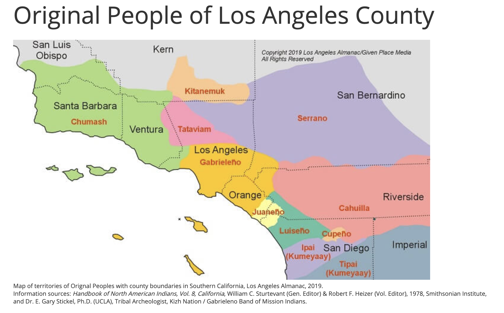
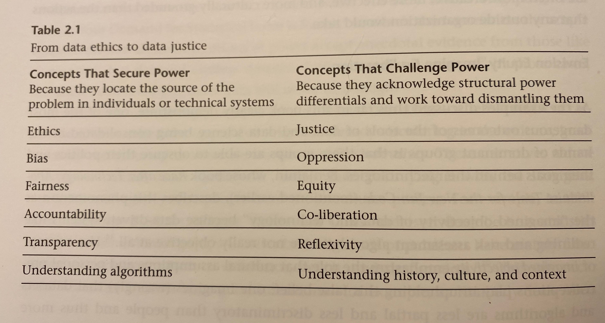

```{r setup, include=FALSE}
knitr::opts_chunk$set(collapse = TRUE)
```

When we reflect on the origin of this blog, we remember that the goal was to consider new ideas about, provoke debate on, and provide examples for **teaching** data science.  That is, we wanted the blog to help inform our own classrooms and those of our readers.

Today's blog entry is about bringing data science examples related to social justice into your classroom. There are myriad reasons why such examples are important for a data science classroom, but we recognize that treatment of sensitive topics should be done thoughtfully and with regard to the larger context surrounding the data. How were they were collected? And why? And by whom?

## Land Acknowledgment

As someone who lives and works in Southern California it is important to
honor the original occupants of the place where we live and work. This land
acknowledgment recognizes systemic and institutional systems of power that have oppressed Indigenous peoples, with many of the same systems in place today that continue to marginalize those with less power. 

> With our deepest respects to the Tongva and Serrano Peoples, past, present, and emerging.

{ width=70% }

## On language

As data scientists, we are surrounded by numbers, but we must come to terms with language that can be as powerful as the associated analyses.  A common refrain in teaching data science surrounds communication as a vital aspect of the data science pipeline.  But we don't often hear reflections on how and what we are communicating.

Table 2.1 from **Data Feminism** describes words and concepts juxtaposed according to ideas of *securing power* versus *challenging* power.  

{ width=60% }


## Examples

#### Bias vs Oppression

[Machine Bias](https://www.propublica.org/article/machine-bias-risk-assessments-in-criminal-sentencing) by Angwin et al. describes an algorithm that predicts recidivism rates for individuals charged with a crime.  The data used, obtained by a FOIA (Freedom of Information Act) request, is provided on the [associated GitHub site](https://github.com/propublica/compas-analysis).

The data and associated analyses show clearly that the accuracy associated with predicted recidivism is similar across Black and white individuals.  **However** Black individuals are predicted to recidivate with a false positive rate nearly double that of whites; white individuals are predicted to recidivate with a false negative rate nearly double that of Blacks.

As the title of the article suggests, the recidivism algorithm is **biased** against Black defendants.  However, the impact of the bias for Black defendants results in systematic **oppression** of liberty (false convictions) and franchisement (convictions lead to disenfranchisement in many states).  

#### Fairness vs Equity

We provide the image below to indicate the difference between being equal and equitable.  We see that each person in the image on the right (equity) has the number of crates that they need to stand on in order to be able to watch the game.  Additionally, we also recognize that the individuals are different heights, not because of their inherent worth (i.e., a deficit model) but because of opportunity gaps driven by the context around them.


.](IISC_EqualityEquity.png){ width=50% }

[The Stanford Open Policing Project](https://openpolicing.stanford.edu/) has provided a comprehensive [data repository](https://openpolicing.stanford.edu/data/) including traffic stops for dozens of state and local police departments across the US.

An [analysis of the data](https://www.nature.com/articles/s41562-020-0858-1) indicates that there are substantial racial discrepancies in traffic policing.  The analysis does an excellent job creating comparison groups to make their claims, yet, there is still room for understanding the larger context of traffic and racial discrepancies.

Consider one system that created structural racial discrepancies in the US. [Redlining](https://en.wikipedia.org/wiki/Redlining) refers to the systematic exclusion of people of color from various governmental services and, in particular, housing that took place in the second half of the 20th century.  The use of a neighborhood's racial demographics as a significant component in determining property values prevented people of color from obtaining mortgages, and specifically from participating in Federal mortgage lending programs. As a result home ownership levels remain far lower for people of color. Such housing discrimination resulted in many individuals of color needing to live far distances from their employment, a trend which continues today.

If we understand the larger systems which influence where people live and work, do we believe that traffic regulations should be implemented equally or equitably?  To be clear, we note, the data and analysis suggest that the traffic policing happens neither equitably nor equally. But we are remiss in having the discussion of traffic policing if it is not done in a larger context of other injustices.

## In the Classroom

We recognize that bringing up data and issues of social justice in the classroom can be fraught.  The work we do to become anti-racist is a life-long endeavor and a practice in which we are always learning and growing.  For us, we try to listen carefully, to recognize that our impact outweighs our intention, and to avoid becoming defensive.  

Our students help us on this journey, and they appreciate the effort we take to bring difficult conversations to the classroom in a thoughtful way.  Surveying them anonymously and asking for feedback demonstrates that you have an open mind and are ready to listen.  Their comments may provide you with creative approaches to the classroom environment.

Our colleagues in other disciplines (e.g., the humanities and social sciences) are important partners, as many teach and research about these highly charged yet critically important questions.  As always, we value and encourage interdisciplinary collaboration!

### Learn more

* [Data analysis for social justice in a Native classroom](https://education.rstudio.com/blog/2020/06/native-classroom/) by [Nic Thompson Gonzalez](http://www.nicolethompsongonzalez.com/)

* [Data-Pop Alliance](https://datapopalliance.org/) is a collaborative laboratory created by the Harvard Humanitarian Initiative, MIT Connection Science, and Overseas Development Institute. 

* [Data-Driven Justice](https://www.naco.org/node/129601) initiative brings communities together to disrupt the cycle of incarceration and crisis.

* [MIT Connection Science](http://connection.mit.edu/) The world’s largest digital networks afford limitless new possibilities … some promising, others alarming.  Our aim is to revolutionize these networks, rather than be controlled by them, through intensive, multi-disciplinary research that provides ground-breaking insights into human behavior and fosters innovations that improve lives.

* [DataKind Labs](https://www.datakind.org/) brings high-impact organizations together with leading data scientists to use data science in the service of humanity. 

* Pierson et al. [A large-scale analysis of racial disparities in police stops across the United States](https://www.nature.com/articles/s41562-020-0858-1), *Nature: Human Behaviour*, 2020.

#### Acknowledgments

Thanks much to Leah Schmalzbauer and Karen Sanchez-Eppler for useful conversations about how to address issues of diversity and inclusion in the classroom and our teaching.


### About this blog 

Last summer we wrote a series of blog entries designed to start conversations around teaching data science, [Teach Data Science](https://teachdatascience.com/).  We covered topics such as data science software, data ingestation, data technologies, data wrangling, visualization & exploration, communication, and key reports and findings on data science.

One key element that was lacking on our 2019 blog was a discussion about and a commitment to teaching the ethical aspects of data science.  We have now found ourselves in the summer of 2020, overwhelmed by the state of the world and re-committed to the ethical challenges which can help data science be a positive force for change.

Although none of us are experts in ethics, we have all included ethics discussions in our classrooms for many years.  In the weeks to come, we will share some of the ways we engage our students in these important topics.  We will provide resources for readings, examples, datasets, and exercises.  We believe that data ethics are part of every data science analysis and classroom experience, and we hope that this summer's blog will entice you into presenting ethical dilemmas and related conversations to your students early and often.

During the summer of 2020, we plan to write a dozen blog entries starting on Monday, July 6th.  We hope that you bookmark the site and check in regularly.  Want a reminder?  Sign up for emails at https://groups.google.com/forum/#!forum/teach-data-science (you must be logged into Google to sign up).
