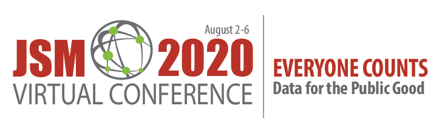

```{r setup, include=FALSE}
knitr::opts_chunk$set(collapse = TRUE)
library(tidyverse)
library(readxl)
library(knitr)
```


The (virtual) [JSM 2020](https://ww2.amstat.org/meetings/jsm/2020/) kicks off this weekend, and as always, there are some great events on the schedule.
In this entry, we begin by enumerating some sessions that are relevant to data ethics, then close with some other sessions that we suspect may be of interest to those teaching statistics and data science courses.

<center>
{ width=80% }
</br>
</center>

Want to learn more?  Check out the [online program](https://ww2.amstat.org/meetings/jsm/2020/onlineprogram/index.cfm).

## Ethics-related sessions

- [Ethical Academic Collaboration from the Outside In](https://ww2.amstat.org/meetings/jsm/2020/onlineprogram/AbstractDetails.cfm?abstractid=313158): Invited Poster (Sunday, August 2nd 12:30-3:30pm)
- [Weapons of Math Destruction](https://ww2.amstat.org/meetings/jsm/2020/onlineprogram/AbstractDetails.cfm?abstractid=314105): panel discussion (Monday, August 3rd 10:00am-11:50pm)
- [Doing Social Justice: Turning Talk into Action in a Statistics Service-Learning Course](https://ww2.amstat.org/meetings/jsm/2020/onlineprogram/AbstractDetails.cfm?abstractid=313414): Topic Contributed talk (Monday, August 3rd: 1:00-2:50pm)
- [Assessing Racial and Ethnic Fairness of a Suicide Risk Prediction Model](https://ww2.amstat.org/meetings/jsm/2020/onlineprogram/AbstractDetails.cfm?abstractid=309350): Invited talk (Tuesday, August 4th 10:00-11:50am)
- [Detecting Undercompensated Groups in Plan Payment Risk Adjustment](https://ww2.amstat.org/meetings/jsm/2020/onlineprogram/AbstractDetails.cfm?abstractid=308157): Invited talk (Tuesday, August 4th 10:00-11:50am)
- [Ethics and Data Science](https://ww2.amstat.org/meetings/jsm/2020/onlineprogram/AbstractDetails.cfm?abstractid=309598): Roundtable session (Tuesday, August 4th 12:00-1:00pm)
- [Experimental Evaluation of Computer-Assisted Human Decision Making: Application to Pretrial Risk Assessment Instrument](https://ww2.amstat.org/meetings/jsm/2020/onlineprogram/AbstractDetails.cfm?abstractid=309356): Invited talk (Tuesday, August 4th 1:00-2:50pm)
- [Privatization of Data and Data Privacy: Local Data Flows](https://ww2.amstat.org/meetings/jsm/2020/onlineprogram/AbstractDetails.cfm?abstractid=312554): Topic Contributed talk (Tuesday, August 4th 1:00-2:50pm)
- [Cocreating and Recreating an Inclusive Statistical and Data Sciences Program at Smith College](https://ww2.amstat.org/meetings/jsm/2020/onlineprogram/AbstractDetails.cfm?abstractid=313011): Topic Contributed talk (Tuesday, August 4th 1:00-2:50 PM)
- [Assessing Risk Assessment in San Francisco](https://ww2.amstat.org/meetings/jsm/2020/onlineprogram/AbstractDetails.cfm?abstractid=309351): Invited talk (Wednesday, August 5th 10:00-11:50am)
- [Teaching Ethics to Econometrics Students](https://ww2.amstat.org/meetings/jsm/2020/onlineprogram/AbstractDetails.cfm?abstractid=310957): Contributed talk (Wednesday, August 5th 10:00am-2:00pm)
- [The Need for Interpretable and Fair Algorithms in Health Care and Policy](https://ww2.amstat.org/meetings/jsm/2020/onlineprogram/AbstractDetails.cfm?abstractid=309165): Invited talk (Wednesday, August 5th 1:00-2:50pm)
- [Teaching with Data for the Public Good](https://ww2.amstat.org/meetings/jsm/2020/onlineprogram/ActivityDetails.cfm?SessionID=219247): Inside-Out Statistics: Teaching Evidence-Based Reasoning in Introductory Courses,
Who’s Underrepresented? Modeling Undercounts in the U.S. Census, and
Difficult Dialogues: Communicating Data Analyses Effectively: Invited talks (Wednesday, August 5th 1:00-2:50pm)
- [Building Statistical and Multivariable Thinking with Social Justice Investigations](https://ww2.amstat.org/meetings/jsm/2020/onlineprogram/AbstractDetails.cfm?abstractid=312355): Topic Contributed talk (Thursday, August 6th: 10:00-11:50am)
- [When Black Box Algorithms Are (Not) Appropriate: A Principled Prediction-Problem Ontology](https://ww2.amstat.org/meetings/jsm/2020/onlineprogram/AbstractDetails.cfm?abstractid=313344): Contributed talk (Thursday, August 6th 10:00am-2:00pm)
- [Counterfactually Fair Risk Assessment Instruments](https://ww2.amstat.org/meetings/jsm/2020/onlineprogram/AbstractDetails.cfm?abstractid=313853): Contributed talk (Thursday, August 6th 10:00am-2:00pm)
- [The Statistician as an Investigator and Educator, Not Just a Power Calculator, on Clinical Research Protocols
](https://ww2.amstat.org/meetings/jsm/2020/onlineprogram/AbstractDetails.cfm?abstractid=309704): Roundtable session (Thursday, August 6th 12:00-1:00pm)


## Other teaching related sessions

On Monday at 1:00pm, Jo is chairing the [Journal of Statistics Education](https://ww2.amstat.org/meetings/jsm/2020/onlineprogram/ActivityDetails.cfm?SessionID=219492) session where Nicole Lazar will talk about "What to Teach (And What Not to Teach) About P-Values", I will discuss "The Role of Computing at the Core of a Modern Introductory Statistics Course", and Kevin Cummiskey will talk about "Multivariate Thinking, Confounding and Causal Inference in Intro Stats".

But there are so many really interesting sessions that are relevant to those teaching statistics and
data science.  Interested in finding some to view?  We highly recommend Mine Çetinkaya-Rundel's excellent [JSM 2020 Shiny app](https://minecr.shinyapps.io/jsm2020-schedule) as an interactive way to explore (see [here](https://github.com/mine-cetinkaya-rundel/jsm2020-schedule) for the source code to this app).


## More info on the blog

Last summer we wrote a series of blog entries designed to start conversations around teaching data science, [Teach Data Science](https://teachdatascience.com/).  We covered topics such as data science software, data ingestation, data technologies, data wrangling, visualization & exploration, communication, and key reports and findings on data science.

One key element that was lacking on our 2019 blog was a discussion about and a commitment to teaching the ethical aspects of data science.  We have now found ourselves in the summer of 2020, overwhelmed by the state of the world and re-committed to the ethical challenges which can help data science be a positive force for change.

Although none of us are experts in ethics, we have all included ethics discussions in our classrooms for many years.  In the weeks to come, we will share some of the ways we engage our students in these important topics.  We will provide resources for readings, examples, datasets, and exercises.  We believe that data ethics are part of every data science analysis and classroom experience, and we hope that this summer's blog will entice you into presenting ethical dilemmas and related conversations to your students early and often.


During the summer of 2020, we plan to write a dozen blog entries.  We hope that you bookmark the site and check in regularly.  Want a reminder?  Sign up for emails at https://groups.google.com/forum/#!forum/teach-data-science (you must be logged into Google to sign up).

